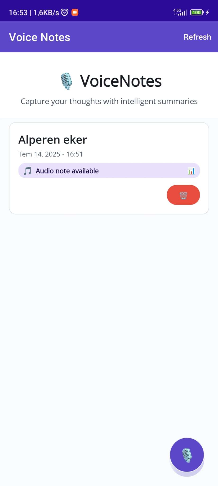
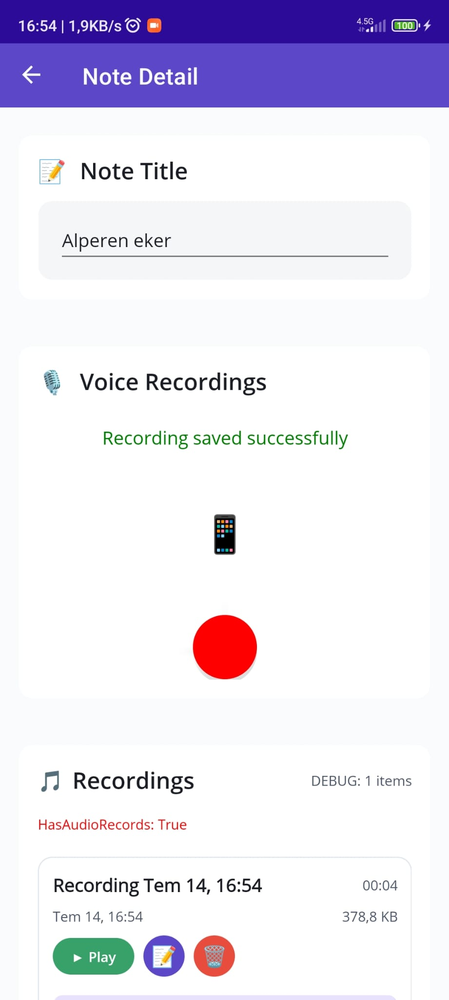
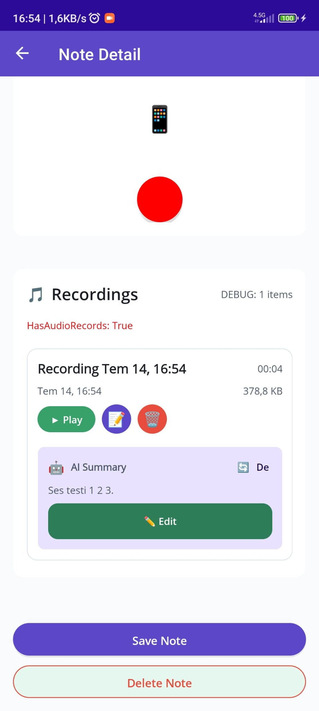

# VoiceNotes - AI-Powered Voice Note Management Platform


## Overview

VoiceNotes is a complete voice note management platform consisting of a cross-platform mobile application and a cloud-based API backend. The platform enables users to record, manage, and automatically transcribe voice notes using advanced AI technology powered by AssemblyAI. Built with modern technologies and best practices, VoiceNotes provides a seamless experience from recording to AI-powered content analysis.

## Platform Architecture

```
VoiceNotes Platform
├── Mobile App (.NET MAUI)     # Cross-platform mobile application
│   ├── Android Support        # Native Android implementation
│   ├── iOS Support           # Native iOS implementation
│   ├── Audio Recording       # Multi-format audio capture
│   ├── Local Storage         # SQLite database
│   └── API Integration       # Cloud backend communication
│
└── Backend API (Node.js)      # Cloud-based processing service
    ├── Audio Upload          # File upload and management
    ├── AssemblyAI Integration # Speech-to-text transcription
    ├── AI Summarization      # Content analysis and summarization
    └── Render.com Hosting    # Production deployment
```

## 📱 Visual Gallery

### Mobile App Demo


### App Screenshots
<div align="center">
  
  
  
</div>

*VoiceNotes mobile app showing: Notes List, Recording Interface, and Audio Management features*

## Key Features

### Mobile Application
- **Cross-Platform**: Native Android and iOS apps from single codebase
- **Multi-Audio Recording**: Record multiple audio clips per note
- **Offline Functionality**: Full local storage and offline operation
- **Modern UI**: Material Design 3 with responsive layouts
- **Real-time Playback**: Audio playback controls with state management
- **Multilingual Support**: English and Turkish localization

### Backend API
- **AI Transcription**: High-accuracy speech-to-text using AssemblyAI
- **Smart Summarization**: AI-powered content summarization
- **Language Detection**: Automatic language identification
- **Cloud Storage**: Secure temporary file processing
- **Scalable Architecture**: Auto-scaling cloud deployment

### AI Capabilities
- **AssemblyAI Integration**: Professional-grade speech recognition
- **Multiple Languages**: Support for various languages and dialects
- **Key Point Extraction**: Automatic identification of important topics
- **Sentiment Analysis**: Emotional tone detection
- **Speaker Identification**: Multi-speaker audio processing

## Technology Stack

### Mobile Application (VoiceNotes/)
- **.NET 8 MAUI** - Cross-platform framework
- **C# 12** - Modern language features
- **MVVM Pattern** - Clean architecture
- **SQLite** - Local database
- **Plugin.AudioRecorder** - Audio recording
- **Refit** - HTTP client library
- **Material Design 3** - UI framework

### Backend API (VoiceApi/)
- **Node.js 18+** - Runtime environment
- **TypeScript 5+** - Type-safe development
- **Express.js** - Web framework
- **AssemblyAI SDK** - AI transcription service
- **Multer** - File upload handling
- **Render.com** - Cloud hosting

## Getting Started

### Prerequisites
- .NET 8 SDK or later
- Node.js 18+ and npm
- Visual Studio 2022 or JetBrains Rider
- AssemblyAI API key ([Get one here](https://www.assemblyai.com/dashboard))
- Android SDK (for Android development)
- Xcode (for iOS development on macOS)

### Quick Setup

1. **Clone the Repository**
   ```bash
   git clone https://github.com/yourusername/VoiceNotes.git
   cd VoiceNotes
   ```

2. **Setup Backend API**
   ```bash
   cd VoiceApi/voicenotesapi
   npm install
   
   # Create environment file
   cp .env.example .env
   # Add your AssemblyAI API key to .env
   
   # Start development server
   npm run dev
   ```

3. **Setup Mobile App**
   ```bash
   cd ../../VoiceNotes
   dotnet restore
   
   # Run on Android
   dotnet build -t:Run -f net8.0-android
   
   # Run on iOS (macOS only)
   dotnet build -t:Run -f net8.0-ios
   ```

## Project Structure

```
VoiceNotes/
├── VoiceNotes/                 # Mobile Application
│   ├── Models/                 # Data entities
│   ├── ViewModels/            # MVVM business logic
│   ├── Views/                 # UI and XAML files
│   ├── Services/              # API and audio services
│   ├── Data/                  # Database context
│   ├── Helpers/               # Utilities and converters
│   └── Resources/             # Styles, strings, assets
│
├── VoiceApi/                   # Backend API
│   └── voicenotesapi/
│       ├── src/
│       │   ├── controllers/    # API endpoints
│       │   ├── services/       # AssemblyAI integration
│       │   ├── models/         # TypeScript interfaces
│       │   ├── routes/         # Express routes
│       │   └── middleware/     # Custom middleware
│       └── uploads/            # Temporary file storage
│
└── README.md                   # This file
```

## Core Workflow

1. **Recording**: User records audio using the mobile app
2. **Local Storage**: Audio stored locally with metadata in SQLite
3. **Upload**: Audio uploaded to backend API when connected
4. **Processing**: AssemblyAI processes audio for transcription
5. **AI Analysis**: Content analyzed for summarization and key points
6. **Synchronization**: Results synchronized back to mobile app
7. **Offline Access**: All data available offline on mobile device

## Deployment

### Mobile App Deployment
- **Android**: Generate APK/AAB files for Google Play Store
- **iOS**: Create IPA files for App Store distribution
- **Development**: Direct deployment to connected devices

### Backend API Deployment (Render.com)

The API is deployed on Render.com with the following configuration:

1. **Environment Variables**:
   - `ASSEMBLYAI_API_KEY`: Your AssemblyAI API key
   - `NODE_ENV`: Set to "production"
   - `PORT`: Automatically set by Render.com

2. **Deployment Process**:
   - Connect GitHub repository to Render.com
   - Configure automatic deployments from main branch
   - Environment variables managed securely in Render dashboard
   - SSL certificates automatically provisioned
   - Health monitoring and auto-scaling enabled

3. **Production URL**: `https://voicenotesapi.onrender.com`

## API Integration

The mobile app communicates with the backend API through the following endpoints:

### Core Endpoints
- `POST /api/audio/upload` - Upload audio files
- `POST /api/audio/:id/transcribe` - Start transcription
- `GET /api/audio/:id/summary` - Get AI summary and transcription
- `GET /api/audio/:id/status` - Check processing status
- `GET /health` - Health check

### Authentication & Security
- API key authentication for AssemblyAI
- HTTPS encryption for all communications
- Environment-based configuration
- Temporary file cleanup for privacy
- CORS configuration for mobile access

## AssemblyAI Integration Details

### Features Utilized
- **Universal-2**: Latest high-accuracy speech model
- **Language Detection**: Automatic language identification
- **Speaker Labels**: Speaker diarization for multi-speaker audio
- **Sentiment Analysis**: Emotional tone detection
- **Chapter Detection**: Automatic content segmentation
- **Key Phrase Extraction**: Important topic identification

### Supported Audio Formats
- MP3, WAV, M4A, OGG, WebM, AAC
- Sample rates: 8kHz to 48kHz
- Mono and stereo audio
- File size limits: Up to 100MB per file

## Development Guidelines

### Mobile App Development
1. Follow MVVM pattern with dependency injection
2. Use async/await for all I/O operations
3. Implement comprehensive error handling
4. Follow Material Design 3 guidelines
5. Ensure proper resource disposal

### Backend API Development
1. Maintain TypeScript type safety
2. Implement proper error handling and logging
3. Follow RESTful API design principles
4. Use environment variables for configuration
5. Ensure secure file handling

### Testing Strategy
- Unit tests for business logic
- Integration tests for API endpoints
- UI tests for mobile app functionality
- End-to-end testing for complete workflows

## Contributing

We welcome contributions from the community! Here's how to get involved:

### How to Contribute
1. **Fork** the repository
2. **Create** a feature branch (`git checkout -b feature/amazing-feature`)
3. **Commit** your changes (`git commit -m 'Add some amazing feature'`)
4. **Push** to the branch (`git push origin feature/amazing-feature`)
5. **Open** a Pull Request

### Development Setup
1. Follow the setup instructions above
2. Make sure all tests pass
3. Follow existing code style and patterns
4. Update documentation for any new features
5. Add tests for new functionality

### Code Standards
- Use meaningful variable and method names
- Follow established patterns in the codebase
- Add comprehensive comments for complex logic
- Ensure type safety in TypeScript code
- Follow SOLID principles in C# code

## Security & Privacy

### Data Protection
- **Local Storage**: Audio files stored securely on device
- **Encryption**: All API communications use HTTPS
- **Temporary Processing**: Server files deleted after processing
- **No Persistent Storage**: Voice data not permanently stored on servers
- **API Key Security**: Environment-based key management

### Privacy Considerations
- Users maintain full control over their audio data
- Optional cloud processing for AI features
- Local-first architecture for offline functionality
- Transparent data handling policies

## Performance Optimization

### Mobile App
- Efficient audio recording and playback
- Optimized SQLite database operations
- Memory management for large audio files
- UI responsiveness during processing
- Battery usage optimization

### Backend API
- Asynchronous processing for scalability
- Efficient file streaming and cleanup
- Connection pooling and resource management
- Auto-scaling based on demand
- Caching strategies for repeated requests

## Monitoring & Analytics

### Health Monitoring
- API health checks and uptime monitoring
- Performance metrics and response times
- Error tracking and logging
- AssemblyAI usage monitoring
- Mobile app crash reporting

### Business Intelligence
- User engagement metrics
- Audio processing statistics
- Feature usage analytics
- Performance benchmarking
- Cost optimization insights

## Roadmap

### Upcoming Features
- Real-time transcription during recording
- Advanced search and filtering
- Voice command integration
- Team collaboration features
- Additional language support
- Custom AI model training

### Platform Expansion
- Web application interface
- Desktop applications
- Browser extension
- API for third-party integrations
- Enterprise features and admin tools

## Support & Community

### Getting Help
- **Documentation**: Comprehensive guides in repository wiki
- **Issues**: Report bugs and request features on GitHub
- **Discussions**: Community discussions and Q&A
- **Email**: Direct contact for serious issues

### Community Resources
- **GitHub Discussions**: Ask questions and share ideas
- **Wiki**: Detailed technical documentation
- **Examples**: Sample integrations and use cases
- **Blog**: Development updates and tutorials

## License

This project is licensed under the MIT License - see the [LICENSE](LICENSE) file for details.

## Acknowledgments

- **AssemblyAI** - Providing world-class speech recognition technology
- **Render.com** - Reliable and scalable cloud hosting platform
- **Microsoft** - .NET MAUI framework and development tools
- **Node.js Community** - Excellent ecosystem and tooling
- **Open Source Contributors** - Everyone who contributes to this project

---

**Built with ❤️ using modern technologies • Powered by AssemblyAI • Hosted on Render.com**

For more detailed documentation, visit our [Wiki](../../wiki) or check out the individual README files in each project directory.
